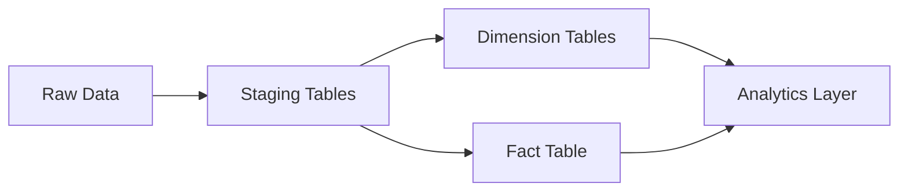

# GCP Sales Analytics Data Pipeline

## 📌 Project Overview

This project demonstrates the design and implementation of an end-to-end **data analytics pipeline** using **Google BigQuery**.

The pipeline transforms raw transactional data into a structured **data warehouse model (Star Schema)** to enable efficient analytical querying and business insights.

---

## 🏗️ Architecture Overview



---

## ⚙️ Tech Stack

* **Cloud Platform**: Google Cloud Platform (GCP)
* **Data Warehouse**: BigQuery
* **Language**: SQL
* **Version Control**: GitHub

---

## 📂 Repository Structure

```
gcp-sales-analytics-pipeline/
│
├── sql/                 # Data transformation layer
│   ├── 01_stg_orders.sql
│   ├── 02_stg_customers.sql
│   ├── 03_stg_products.sql
│   ├── 04_dim_customer.sql
│   ├── 05_dim_product.sql
│   ├── 06_fact_sales.sql
│
├── queries/             # Analytical queries
│   ├── revenue_by_country.sql
│   ├── top_customers.sql
│   ├── revenue_by_category.sql
│
└── README.md
```

---

## 🔄 Data Modeling Approach

This project follows a **Star Schema design**, widely used in data warehousing.

### ⭐ Fact Table

* `fact_sales`

  * Stores transactional data
  * Includes derived metric: `total_amount`

### 📊 Dimension Tables

* `dim_customer`
* `dim_product`

👉 This design enables:

* Faster query performance
* Simplified joins
* Scalable analytics

---

## 🔧 Data Pipeline Flow

1. **Staging Layer**

   * Raw data is ingested into staging tables
   * Minimal transformation applied

2. **Transformation Layer**

   * Data is cleaned and structured
   * Dimension tables created

3. **Fact Layer**

   * Core transactional data is modeled
   * Business metrics calculated

4. **Analytics Layer**

   * SQL queries generate business insights

---

## 📊 Analytical Use Cases

### 🔹 Revenue by Country

Identifies top-performing regions based on total revenue.

### 🔹 Customer Analysis

Highlights high-value customers contributing to revenue.

### 🔹 Product Performance

Evaluates revenue distribution across product categories.

---

## 🚀 How to Execute

1. Create a dataset in BigQuery
2. Execute SQL scripts in the `sql/` folder sequentially
3. Run analytical queries from the `queries/` folder

---

## 📈 Key Highlights

* Designed a **scalable data warehouse model**
* Implemented **ETL transformations using SQL**
* Built **fact and dimension tables** for analytics
* Enabled **business intelligence reporting** using structured queries

---

## 💡 Learnings & Outcomes

* Hands-on experience with **BigQuery data modeling**
* Understanding of **ETL pipeline design**
* Practical implementation of **Star Schema**
* Writing optimized SQL for analytical queries

---

## 👩‍💻 Author
Varshitha Reddy
(Data Engineer).
